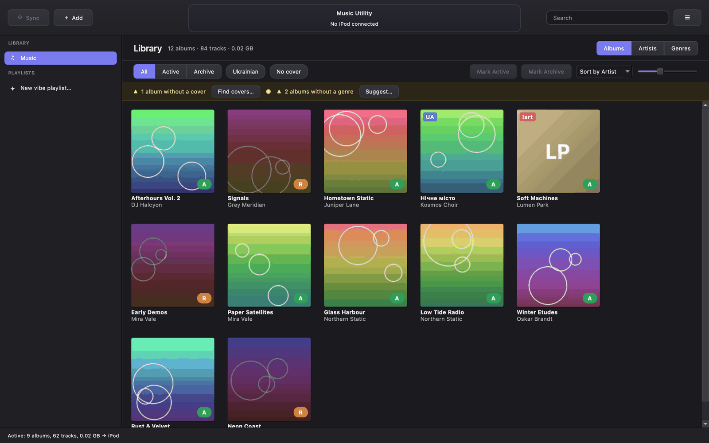
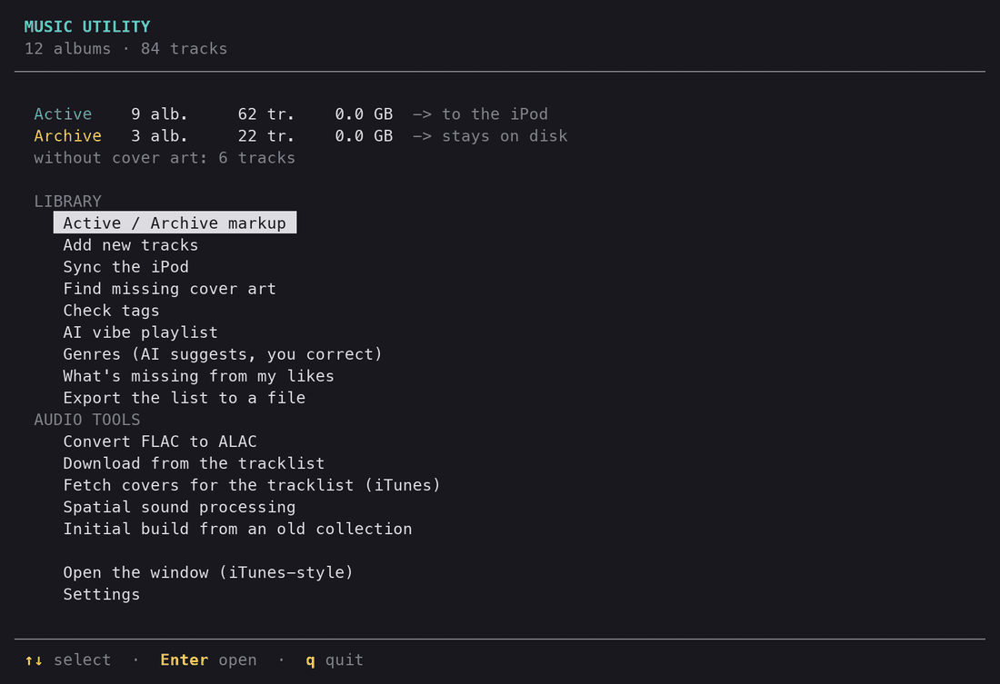
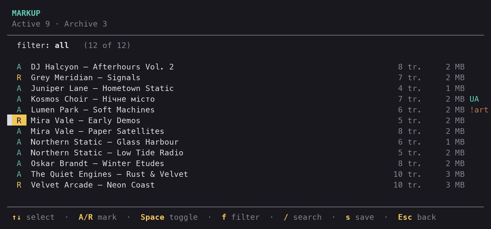
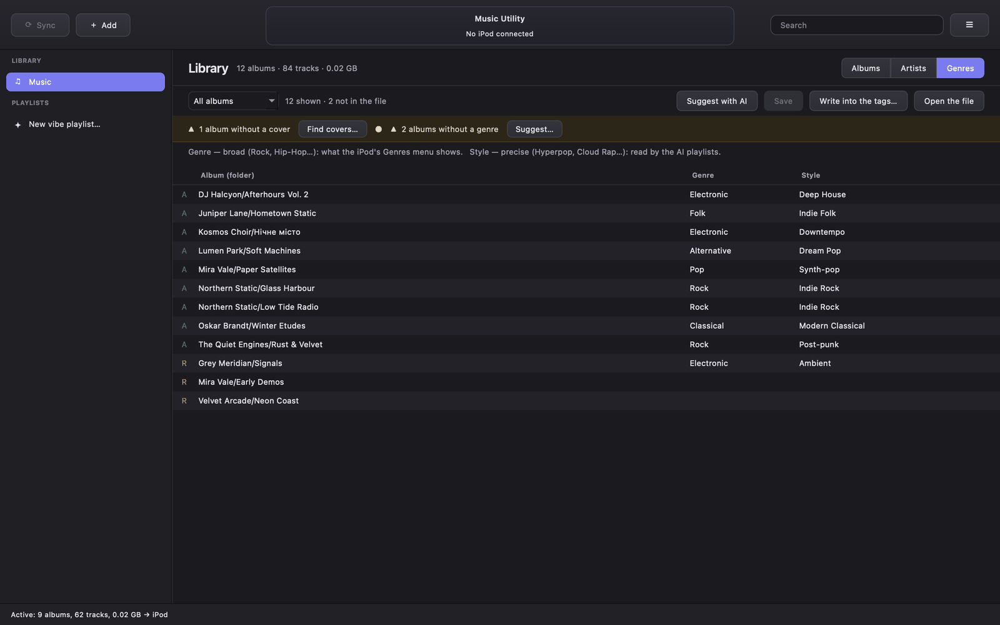

# PodVault — Music Utility


Tools for keeping a music library in shape for an old iPod: fixing tags so
albums don't fall apart, splitting the library into what goes on the iPod and
what stays on disk, syncing the device without iTunes, plus a few audio
utilities (FLAC → ALAC, a tracklist downloader, iTunes cover art, spatial
sound). Runs on **Windows, macOS and Linux**.



| The text menu | Active / Archive markup |
|---|---|
|  |  |



<sub>Screenshots use a generated demo library; the artists are made up.</sub>

## Quick start

| | Windows | macOS / Linux |
|---|---|---|
| Text menu | `run.bat` | `./run.sh` |
| The window | `gui.bat` | `./gui.sh` |

Or `python Main.py` / `python Main.py --gui` on any system. The launchers work
from any directory — they find the project by their own location, and every
path inside the project is resolved against the project root, not the current
directory.

On the first run a short wizard asks for the basic settings — where the library
lives, where new tracks come from, how to sync the iPod. Everything can be
changed later on the **Settings** screen.

Settings are stored in `settings.json` in the project folder. The file is
git-ignored: it holds personal paths and must not end up in the repository.
`MUSIC_UTILITY_SETTINGS` can point at another settings file (a second library,
a test setup).

## Installation

Python 3.10+.

```bash
git clone --recurse-submodules https://github.com/nzmnq/PodVault.git
cd PodVault
```

**Windows**

```powershell
py -m venv .venv
.venv\Scripts\python -m pip install -r requirements.txt
```

**macOS / Linux**

```bash
python3 -m venv .venv
.venv/bin/python -m pip install -r requirements.txt
```

The launchers pick the interpreter in this order, so no activation is needed:

| | Windows (`run.bat`) | macOS / Linux (`run.sh`) |
|---|---|---|
| 1. portable Python next to the project | `.python\python.exe` | `.python/bin/python3` |
| 2. virtual environment | `.venv\Scripts\python.exe` | `.venv/bin/python` |
| 3. system-wide | `py -3` / `python` | `python3` / `python` |

**FFmpeg** is needed by the FLAC → ALAC converter, the downloader and the
spatial sound tool. Set its path on the Settings screen, or leave it on `auto`
to use the one in `PATH` or in `bin/`. The library tools don't need it.

| Windows | macOS | Debian / Ubuntu |
|---|---|---|
| `winget install ffmpeg` | `brew install ffmpeg` | `sudo apt install ffmpeg` |

On Linux the window needs Qt's system libraries (on Debian / Ubuntu:
`sudo apt install libxcb-cursor0`), and `soundfile` needs `libsndfile1`.

The iPod's databases are read and written by
[podsync](https://github.com/bla1r1/podsync), a git submodule in
`vendor/podsync`. In a copy cloned without `--recurse-submodules`, fetch it
with `git submodule update --init`. No iTunes is needed on any system.

## The window

`gui.bat` / `./gui.sh`, `python Main.py --gui`, or "Open the window" in the
menu. The same tools in a window (PyQt6) laid out like iTunes — a source list,
an LCD in the toolbar, views of one library — with its own look.

- **Source list** — places only: the **Library**, the **iPod** when it's
  connected (with a capacity bar and an eject button right in its row), and
  **Playlists** with "New vibe playlist…".
- **Library** — three views: **Albums** (a grid of covers), **Artists** (the
  same grid, one artist at a time) and **Genres** (a table: type the genre and
  style, Save, "Write into the tags…"). Filters: All / Active / Archive, plus
  Ukrainian and No cover. Click an album's A / R badge, or select albums and
  press `A` / `R` (`Space` toggles), to mark it; the status bar collects the
  marks and "Move the files…" applies them. Double-click or `Enter` opens an
  album with its tracks.
- **Needs attention** — a strip above the library: albums without a cover or a
  genre, archive tracks still on the iPod, tracks only on the iPod — each with
  the button that fixes it.
- **Status bar** — how big Active is and whether it fits the iPod.
- **☰ menu** — the library tools (covers, tag check, likes, export, initial
  build), the audio tools, Settings. **Add** takes a folder of new tracks; so
  does dropping a folder onto the window.
- Every tool that changes something runs as a dry run first, in a sheet with
  its full output; **Apply** does it for real. Only one tool runs at a time.

Shortcuts (`Cmd` instead of `Ctrl` on macOS): `Ctrl+S` sync, `Ctrl+N` add
tracks, `Ctrl+F` search, `Ctrl+1/2/3` albums / artists / genres, `Ctrl+R` read
the library again, `Ctrl+E` eject, `Ctrl+,` settings. Light or dark follows
the system. Colours, symbols, sizes and timings all live in `src/gui/theme.py`.

## The main screen

**Library**

| | |
|---|---|
| Active / Archive markup | A list of albums: `A` — goes to the iPod, `R` — stays on disk. `s` saves and moves the folders. |
| Add new tracks | Takes a folder of new mp3s, fixes their tags, skips what's already in the library. |
| Sync the iPod | Makes the device hold exactly what's in `Active`. |
| Find missing cover art | Deezer, then MusicBrainz. Only applied when the artist matches. |
| Check tags | Album Artist, ID3v2.3 / UTF-16, no v2.4 frames; can repair the latter. |
| AI vibe playlist | Describe a mood in words; Claude picks and orders tracks from `Active`, helped by tempo/energy measured from the audio. Saved as `.m3u8`. |
| Genres | The AI suggests a genre and a precise style per album, you correct the file, then they're written into the tags. |
| What's missing from my likes | Compares a Spotify data export, an Apple Music playlist page or a text list with the library. |
| Export the list to a file | The markup as a text file, for editing elsewhere. |

**Audio tools**

| | |
|---|---|
| Convert FLAC to ALAC | FLAC files from the input folder → `.m4a` (ALAC) in the output folder. |
| Download from the tracklist | Downloads the tracks listed in the tracklist and tags them. |
| Fetch covers for the tracklist | Fills cover URLs in the tracklist from the iTunes API. |
| Spatial sound processing | An experimental stereo-to-spatial pass. |
| Initial build from an old collection | One-time: builds the library from an unsorted collection. |

Everything that changes files runs as a dry run first and asks before applying.

## Project structure

```
Main.py                 the program (menu, first-run wizard, settings screen)
run.bat, run.sh         launcher (text menu): Windows / macOS, Linux
gui.bat, gui.sh         launcher (the window)
src/
  settings.py           settings: defaults, load/save, validation
  library.py            library contents, Active/Archive moves
  add_incoming.py       adding new tracks
  ipod_sync.py          iPod sync, saving tracks off the iPod, disk mirror
  ipod.py               the iPod through podsync: find, read, covers, backups
  gui/                  the window (PyQt6): backend.py runs the same tools
  fetch_covers.py       missing cover art for the library
  verify_clean.py       tag checks (--fix)
  import_likes.py       "what I listen to" lists -> one format
  find_missing.py       comparison with the library
  vibe.py               AI vibe playlists
  genres.py             genre and style per album
  ai.py                 one question to an AI model (Claude Code, Gemini, API)
  build_clean.py        one-time initial build
  musiclib.py, tui.py   shared helpers
  flac_to_alac.py       FLAC -> ALAC
  metadata_download.py  tracklist downloader
  fetch_cover.py        iTunes covers for the tracklist
  sur_sound.py          spatial sound
data/
  tracklist.txt         the tracklist
docs/screenshots/       README pictures
vendor/
  podsync/              the iPod database engine (git submodule)
```

Each script in `src/` also runs on its own, from any directory:
`python src/library.py`, `python src/add_incoming.py --apply`, and so on. They read the same
`settings.json`.

## Library layout

```
<library>/Active/<Artist>/<Album>/NN - Title.mp3     goes to the iPod
<library>/Archive/<Artist>/<Album>/NN - Title.mp3    stays on disk
```

An album's state is **which folder it sits in**. Adding tracks wipes nothing,
and the markup can be changed any number of times.

Ukrainian-language albums are highlighted by the letters `і ї є ґ`, which don't
exist in Russian. That's about language, not genre: folk can't be told apart
from rock by tags, so a human decides.

## Why the tags are rewritten

In the original library the **Album Artist field (TPE2) was empty on every
track**. The iPod groups albums by Album Artist and, when it's missing, falls
back to Artist — so a track with a feature (`Arash/ Helena`) became a separate
artist and tore its album apart.

What's written:

- **TPE2** — set everywhere
- **TPE1** — the main artist only; features move into the title as `(feat. X)`
- **TCON** — the first genre before a separator (`Rap/Hip Hop` → `Hip-Hop`);
  see [Genres](#genres) for fixing them
- **APIC + folder.jpg** — cover art
- **ID3v2.3 / UTF-16** — otherwise an old iPod garbles Cyrillic; v2.4 frames
  such as `TDRC` are removed, the year goes into `TYER`
- one-track folders become a `Singles` album per artist

Compilations get the Album Artist `Разные исполнители` ("Various Artists"). It's
a tag value already written into files, so it isn't translated.

## Artist separators

- **Slash** (`Lil Peep/ Lil Tracy`). The one real name with a slash is
  **AC/DC**, protected in `ARTIST_PROTECT`.
- **Comma** (`wifiskeleton, Jaydes`). `125, Rue Montmartre` is a real name, so a
  string isn't split if the whole name already occurs in the library.

## iPod sync

Sync → 1 (or `python src/ipod_sync.py`) makes the device hold exactly what's
in `Active`: archive tracks leave the iPod, new tracks arrive, and every synced
track gets its cover and its genre from the file. The iPod's own databases —
tracks, playlists, covers — are written by podsync; iTunes isn't involved and
must be closed (on eject it would write its own copy of the database over
ours).

Matching is by tags and duration: a file on the iPod has its own internal path,
and it keeps the tags it had when it was copied. Only tracks **positively
recognised** as archive are deleted; unknown ones are left alone (see
[below](#tracks-only-on-the-ipod)). Existing playlists, smart playlists
included, are kept; deleted tracks drop out of them.

The iPod is found automatically (a drive letter on Windows, `/Volumes` on
macOS, `/media` on Linux) and identified by podsync, or set in Settings → iPod.

A bad write to the database can wipe the iPod's music list, so:

- before every write `iPod_Control/iTunes` and `/Artwork` (~250 MB) are copied
  to `<reports>\ipod-backups` (the last 3 are kept); Sync → 5 (or `--restore`)
  puts the latest one back;
- podsync checks and locks the volume, refuses to write if the database
  changed since it was read, and reads the new database back — every track
  and every file — before it counts as written;
- files of deleted tracks are removed only after that.

```bash
python src/ipod_sync.py                  # what would change
python src/ipod_sync.py --apply
python src/ipod_sync.py --restore
python src/ipod.py                       # what the iPod has (read only)
python src/ipod.py --eject
```

Sync → 4 (`--disk E:` or `--disk /Volumes/PLAYER`) is a plain mirror for Rockbox or disk mode instead;
only the managed subfolder is touched.

### Covers on the iPod

The cover an iPod draws is neither the picture inside the mp3 nor what other
programs report: it's a small pre-rendered copy in `iPod_Control/Artwork`,
linked to the track in the device's own database. Tracks put on the iPod by
other programs often have an artwork record and no such copy. So the sync
asks podsync which tracks really have a thumbnail, and gives the rest their
cover from the file (the embedded picture first, `folder.jpg` otherwise).
Sync → 2 (`python src/ipod.py`) lists what the screen shows without a cover.

### Tracks only on the iPod

The sync never deletes tracks it can't find in `Active` or `Archive` — the
iPod may hold the only copy. `ipod_sync.py --rescue` (Sync → 3 in the menu)
copies them into `<incoming>/From iPod`, reading the iPod's own database and
files; "Add new tracks" then brings them into the
library like any other new track. Already saved tracks aren't copied again.

## Tracklist format

Used by the downloader and the iTunes cover fetcher. One track per line in
`data/tracklist.txt` (the path is a setting):

```text
Artist | Title | Album | Composer | Year | Genre | Track Number | Disc Number | Cover Art URL
```

Example:

```text
Daft Punk | Get Lucky | Random Access Memories | Thomas Bangalter, Guy-Manuel de Homem-Christo | 2013 | Disco | 8 | 1 | https://example.com/cover.jpg
```

If the `Title` field starts with `http`, the downloader treats it as a direct
URL instead of a search query. An optional cookies file (a setting) can help
with restricted downloads.

## "What I listen to" lists

`import_likes.py` understands:

1. **Spotify data export** — spotify.com → Privacy Settings → Download your
   data. No Premium needed. `YourLibrary.json` and `Playlist*.json`.
2. **An Apple Music playlist** saved from the browser as `.html`.
3. **A text list** — `Artist — Album` or `Artist — Album — Track` per line.

`find_missing.py` then reports what's complete, partial or missing, and what is
present but sitting in the archive (no need to download — just mark it `[A]`).

## Genres

Genres were cut down to one broad word when the library was cleaned, and many
were wrong to begin with (hyperpop under `Alternative`). Two tags now:

- **Genre** (`TCON`) — broad: Rock, Hip-Hop, Electronic… It's what the iPod's
  Genres menu shows, so it stays short.
- **Grouping** (`TIT1`) — the precise style: Hyperpop, Cloud Rap, Post-punk…
  The AI playlists read it; the iPod menu isn't cluttered.

`data/genres.txt` (a setting, git-ignored) holds one line per album —
`Artist folder/Album folder | Genre | Style` — and is the source of truth:

```bash
python src/genres.py suggest          # the AI fills in albums not in the file yet
python src/genres.py apply            # what would change in the tags
python src/genres.py apply --apply    # write them
```

`suggest` never touches lines already in the file, so corrections stay; new
albums get their line the next time it runs. The iPod sync then sets the
genre on the iPod copies too.

## AI vibe playlists

```bash
python src/vibe.py "rainy night drive, slow, a bit sad"
python src/vibe.py "gym, loud and fast" --count 40
```

Every `Active` track is analysed once from a 45-second excerpt — tempo,
loudness, how busy, bright, bass-heavy and dynamic it is — and cached in
`reports/vibe_features.json`; later runs analyse only new tracks. Claude gets
the whole catalogue with those numbers and the vibe (roughly 50k tokens),
picks and orders the tracks and names the playlist. The result is saved to
`reports/playlists/<name>.m3u8`.

Settings → AI holds the mode, the default number of tracks and the
model for each mode. Where the pick comes from (`--backend` overrides it):

- **auto** (default) — `cli` if Claude Code is installed, else `gemini` if
  `GEMINI_API_KEY` is set, else `api`. The same project works for everyone.
- **gemini** — Google Gemini through its OpenAI-compatible endpoint, for
  anyone without a Claude subscription. The key is free (aistudio.google.com →
  Get API key, no card); set it once — Windows: `setx GEMINI_API_KEY "..."`,
  macOS / Linux: `export GEMINI_API_KEY=...` in `~/.zshrc` or `~/.bashrc`. The
  free tier's limits (a few requests a minute, some hundreds a day) are plenty
  for playlists. On the free tier Google may use requests to improve its
  models — here that's the list of track names. The model is a setting.
- **cli** — the Claude Code command line, on a Claude subscription, no API
  costs. `auto` finds `claude` in `PATH` or the copy
  bundled with the Claude desktop app (Windows, macOS, Linux). Log in once: run `claude`, type
  `/login`, then `/exit`. Tools, MCP servers and project settings are switched
  off for the call, and nothing is saved to the session history.
- **api** — the Anthropic API (`claude-opus-5`), paid per use; needs
  `ANTHROPIC_API_KEY` (console.anthropic.com → API keys). The library is sent
  as a cached prompt, so a second vibe within the hour costs a fraction of the
  first.

`--apply` / `--push-last` (or "yes" in the menu after a pick) create the
playlist right on the iPod, written into its database by podsync, with a
backup first. Picked tracks that aren't on the iPod yet are copied along with
their covers; nothing is deleted or changed. If a playlist with that name
exists, the new one gets a number.

```bash
python srcibe.py "gym, loud and fast" --apply
python srcibe.py --push-last
```

## Pitfalls already hit

- Windows Explorer doesn't show `TPOS` and draws the artist separator `/` as
  `;`. Look at tags through mutagen.
- When reading v2.3, mutagen substitutes v2.4 frames (`TYER` → `TDRC`,
  `IPLS` → `TIPL`) and writes them back into a v2.3 tag on save. Every writer
  must call `musiclib.drop_v24_frames` before saving; `verify_clean.py --fix`
  cleans up files written without it.
- Stripping an edition suffix must remove the whole bracket group, or
  `Vol. 4 (2009 Remastered Version)` becomes `Vol. 4 (2009`.
- A portable Python build ships without root certificates; HTTPS goes through
  `certifi`. HTTP headers are latin-1, so no Cyrillic in the `User-Agent`.
- The iPod holds tracks with the tags they had when copied. Don't match the
  device by album, and delete only what's positively identified.
- The same song exists as album, compilation and live versions; they're told
  apart by duration.
- An artwork record in the database says nothing about what the iPod screen
  shows: only a thumbnail in an existing `.ithmb` file counts.
- iTunes left open writes its own copy of the iPod's database on eject, over
  whatever was written in the meantime. The sync refuses to run while it is.
- PowerShell 5.1 prepends a BOM to piped input.
- The Spotify Web API refuses every request (403) unless the app owner has
  Premium, and doesn't accept `localhost` as a redirect URI.
- After the Active/Archive split, anything writing into the library root writes
  past both folders. `build_clean.py` refuses to; use `--dest` for a rebuild.

## License

GPL-3.0-only, see `LICENSE`. podsync (`vendor/podsync`) is under
GPL-2.0-or-later, which allows it to be used in a GPL-3.0 program.
